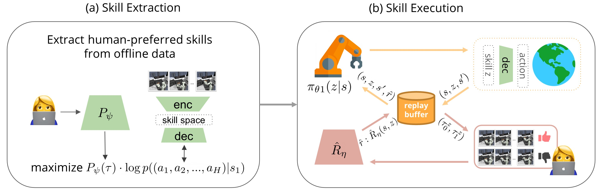

# Skill Preferences: Learning to Extract and ExecuteRobotic Skills from Human Feedback


<p align="center">

</p>
</img></a>


## Setup Guide

```
conda create -n skip python=3.6
conda activate skip
pip install -r requirements.txt
pip install -e .

# installing SPiRL's fork of d4rl
git clone https://github.com/kpertsch/d4rl.git
cd d4rl
pip install -e .
```

Set the environment variables that specify the root experiment and data directories. For example: 
```
mkdir ./exp
export EXP_DIR=./exp
```


## Commands

### SkiP Command
**Skill Extraction:** 

- To train a skill prior model for the kitchen environment over suboptimal dataset with human labels, run
```
python3 spirl/train.py --path=spirl/configs/skill_prior_learning/kitchen/hierarchical_cl --val_data_size=160 --soft_train True --learn_human_ratio 0.1
```

- To train a skill prior model for the kitchen environment over suboptimal dataset without human labels, run
```
python3 spirl/train.py --path=spirl/configs/skill_prior_learning/kitchen/hierarchical_cl --val_data_size=160 --soft_train True --learn_human_ratio 0.0
```

- To train a skill prior model for the kitchen environment over the optimal dataset, run
```
python3 spirl/train.py --path=spirl/configs/skill_prior_learning/kitchen/hierarchical --val_data_size=160 --mixed_data False
```

**Skill Execution:** 

- To train **SkiP** using the pre-trained skill prior from above, run:
```
python3 spirl/rl/train_skip.py --path=spirl/configs/hrl/kitchen/spirl_cl --seed=0 --prefix=skip_1t_Mic --task m
```

- To train **SkiP3x** using the pre-trained skill prior from above, run:
```
python3 spirl/rl/train_skip.py --path=spirl/configs/hrl/kitchen/spirl_cl --seed=0 --prefix=skip3x_1t_Mic --task m --reward_batch 384
```

Results will be written to [WandB](https://www.wandb.com/). Before running RL, 
create an account and then change the WandB entity and project name at the top of [rl/train.py](spirl/rl/train.py) to match your account.

'mkb' represents the Microwave-Kettle-Burner Environment by taking the initial from each of the tasks. This could be changed to 'm', 'k', 'mk', 'kb', 'kbc' to train in Microwave, Kettle, Microwave-Kettle, Kettle-Burner, Kettle-Burner-Cabinet environments instead.

### Baseline Commands

- Train **Oracle (SPiRL)**:
```
python3 spirl/train.py --path=spirl/configs/skill_prior_learning/kitchen/hierarchical --val_data_size=160 --mixed_data False

for env in m, k, mk, kb, mkb, kbs; do
  python3 spirl/rl/train.py --path=spirl/configs/hrl/kitchen/spirl --seed=0 --prefix=SPIRL_kitchen_seed0 --task $env
done
```

- Train **Flat Prior**:
```
python3 spirl/train.py --path=spirl/configs/skill_prior_learning/kitchen/flat --val_data_size=160 --mixed_data False

for env in m, k, mk, kb, mkb, kbs; do
  python3 spirl/rl/train.py --path=spirl/configs/rl/kitchen/prior_initialized/flat_prior/ --seed=0 --prefix=flatPrior_kitchen_seed0 --task $env
done
```

- Train **PEBBLE**:
```
python3 spirl/rl/train_skip.py --path=spirl/configs/rl/kitchen/SAC --seed=0 --prefix=pebble_1t_Mic_seed0 --task m --high_level 0
```


## Acknowledgements
This work is built off of [SPiRL's official codebase](https://github.com/clvrai/spirl), which is cited below:
```
@inproceedings{pertsch2020spirl,
    title={Accelerating Reinforcement Learning with Learned Skill Priors},
    author={Karl Pertsch and Youngwoon Lee and Joseph J. Lim},
    booktitle={Conference on Robot Learning (CoRL)},
    year={2020},
}
```


